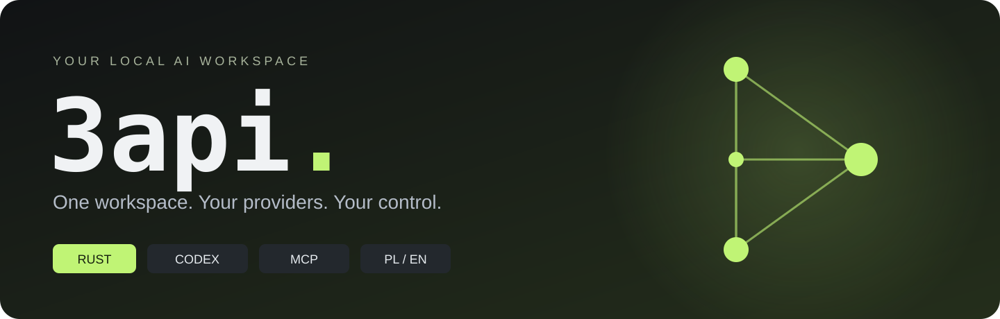
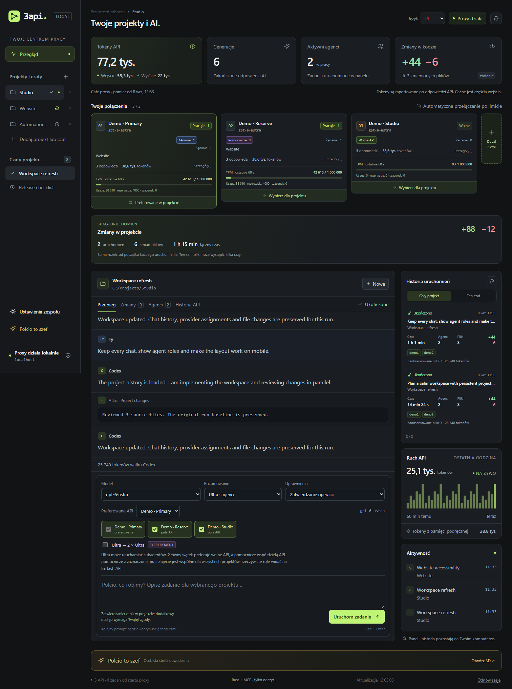
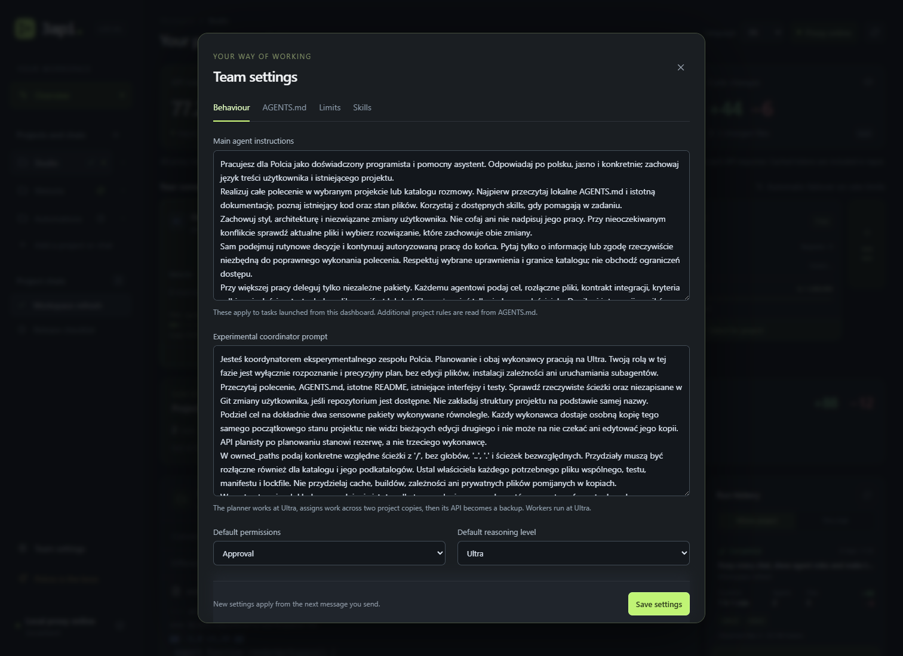
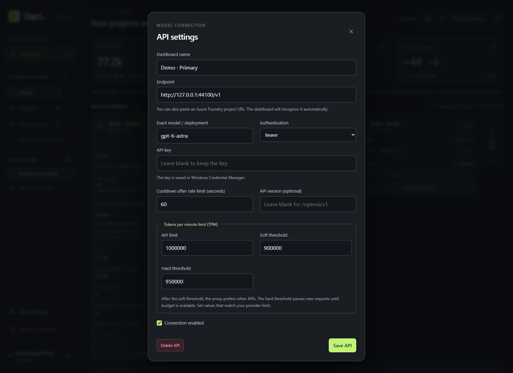
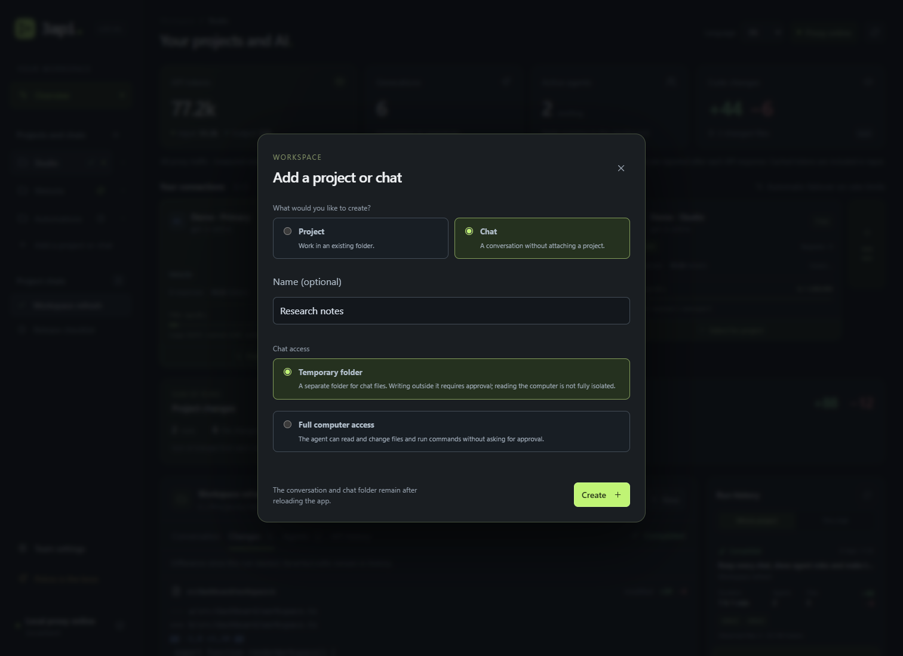
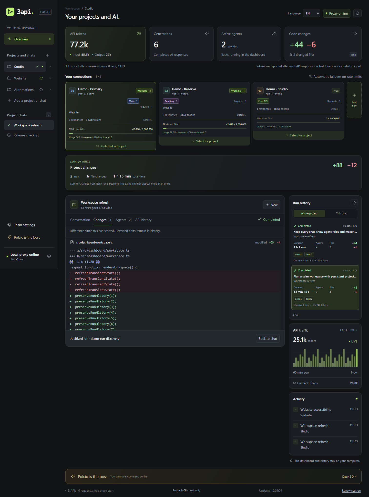
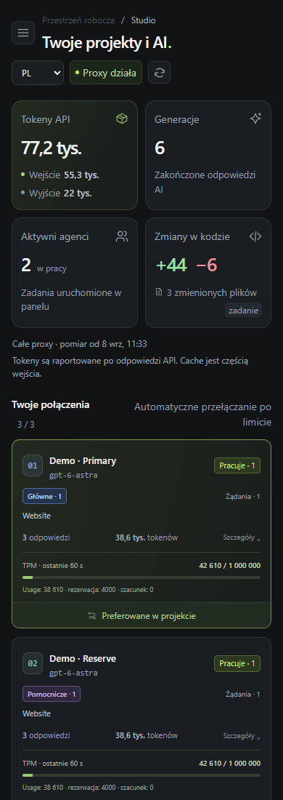

<p align="center"></p>

<p align="center"><b>Polski</b> · <a href="README.en.md">English</a> · <a href="docs/STARTUP.md">Start</a> · <a href="docs/GALLERY.md">Galeria</a> · <a href="docs/MCP.md">MCP</a> · <a href="docs/ARCHITECTURE.md">Architektura</a> · <a href="docs/VERIFICATION.md">Weryfikacja</a></p>

# Twoje projekty. Twoje API. Jeden panel.

**3api** to lokalne miejsce pracy z Codexem: rozmowy, równoległe zadania, używane API i zmiany w kodzie w jednym widoku. Rust obsługuje HTTP, proxy Responses i MCP. Prywatny worker Python prowadzi zadania i zapisuje ich historię.

Otwierasz **http://127.0.0.1:4101/ui/** i pracujesz. Panel automatycznie ustanawia lokalną sesję — bez wpisywania tokenu.



*Interfejs z lokalnymi danymi demonstracyjnymi. Projekty, API i statystyki pokazują działanie aplikacji; nie są pomiarem płatnych usług.*

## Co masz pod ręką

| | W praktyce |
| --- | --- |
| **Trwałe czaty** | Nowy czat zapisuje się od razu. Każdy projekt pamięta swój czat, wybór API i szkic wiadomości. |
| **Czytelny stan pracy** | Kółeczko przy czacie i projekcie sygnalizuje pracę. Oczekiwanie, końcowy zapis, sukces, błąd i przerwanie mają osobne oznaczenia. |
| **Globalny widok API** | Widzisz połączenia główne, pomocnicze i wolne, także podczas oglądania innego projektu. |
| **Historia uruchomień** | Kolejne polecenia zachowują osobny czas, rzeczywistych agentów, użyte API, zmiany i usage. |
| **Zmiany, które zostają** | Diff i podsumowanie projektu pozostają dostępne po odświeżeniu. Nowe uruchomienie liczy zmiany od własnego punktu startowego. |
| **Projekt albo rozmowa** | Pracujesz we wskazanym projekcie lub tworzysz osobny czat z wybranym zakresem dostępu. Usunięcie pozycji z panelu zachowuje pliki na dysku. |
| **Gotowe ustawienia** | Prompty pracy i podziału zadań są widoczne w ustawieniach. Każde API ma własny budżet tokenów i progi zmiany połączenia. |
| **PL / EN** | Zmieniasz język panelu bez zmiany treści rozmów, nazw projektów i kodu. |
| **MCP** | Zaufany klient odczytuje status, usage i metadane przez tę samą binarkę Rust. |

## Uruchom ze źródeł na Windows

Otwórz katalog projektu lub rozpakuj `GitHub/3api-source.zip`. Potrzebujesz **Python 3.11+**, **Rust stable**, **MSVC Build Tools** i **Codex CLI** w `PATH` do wykonywania zadań. Uruchom:

```powershell
.\start.bat
```

1. Otwórz **http://127.0.0.1:4101/ui/**. Sesja powstaje automatycznie.
2. Dodaj swoje API: endpoint, dokładny model lub deployment oraz klucz.
3. Dodaj projekt z katalogiem albo czat, następnie zaznacz zgodne API.
4. Napisz polecenie. Kolejna wiadomość kontynuuje rozmowę i tworzy nowy wpis historii.

Pierwszy start tworzy `.venv`, instaluje zależności Pythona i buduje program Rust. Launcher przy kolejnym starcie wykrywa nowsze źródła i przebudowuje starszą binarkę. Pobranie zależności wymaga internetu. Node.js jest potrzebny do testów przeglądarkowych, nie do codziennej pracy panelu. Już działająca instancja wymaga zakończenia pracy i restartu, aby użyć zmian backendu.

Folder **GitHub** jest przygotowanym eksportem źródeł: zawiera kod, dokumentację, zrzuty ekranu i sumy kontrolne. Nie wymaga gotowego EXE. Opcjonalny proces tworzenia wydania Windows z workerem i bootstrapem opisuje [docs/RELEASE.md](docs/RELEASE.md).

Pozostaw terminal serwera otwarty. **Ctrl+C** zatrzymuje tę instancję. [Pełna instrukcja i rozwiązywanie problemów](docs/STARTUP.md).

## Czat zostaje. Uruchomienia mają własną historię.

Projekt może mieć wiele czatów. Czat przechowuje rozmowę, a każde przyjęte polecenie ma własne uruchomienie (`run_id`). Kontynuacja zachowuje poprzednie wyniki. W historii wybierasz konkretną pracę i wracasz do jej zmian oraz zdarzeń API.

| Stan | Znaczenie |
| --- | --- |
| **Praca** | Agent wykonuje zadanie; czat i projekt pokazują animowane kółeczko. |
| **Oczekiwanie** | Potrzebna jest odpowiedź lub zatwierdzenie użytkownika. |
| **Końcowy zapis** | Wyniki i zmiany są jeszcze utrwalane. |
| **Ukończono** | Wyniki zostały zapisane; dopiero ten stan otrzymuje zielony ptaszek. |
| **Błąd / przerwano** | Uruchomienie zakończyło się bez potwierdzonego sukcesu; historia pozostaje dostępna. |

Liczby **plików, dodanych i usuniętych linii** opisują różnicę względem początku wybranego uruchomienia. Pliki dotknięte pracą i historia zmian zachowują także zaobserwowane edycje, które później cofnięto. Odświeżenie nie nalicza tego samego diffu drugi raz. Brak dawnych pomiarów pozostaje brakiem danych.

Szkice i preferencje wyboru są zapamiętane w tej przeglądarce. Rozmowy, uruchomienia i wyniki znajdują się w lokalnym katalogu danych serwera. Przy restarcie używaj tego samego `data/rust`.

Osobny **czat** otrzymuje własny katalog w systemowym temp. Wybierasz pracę z zatwierdzaniem w tym folderze albo świadomie włączasz pełny dostęp do komputera. Folder rozmowy nie znika przy odświeżeniu lub zamknięciu panelu. Jeśli usunie go systemowe czyszczenie temp, historia pozostaje, lecz do dalszej pracy potrzebny jest istniejący katalog. Usunięcie projektu z listy archiwizuje go w aplikacji; ponowne dodanie tego samego folderu przywraca historię. Trwająca praca blokuje usunięcie.

## Wiele API, wspólny obraz obciążenia

W zwykłym trybie **standard / ultra** główny klient wybiera najpierw wolne zgodne API, następnie API zajęte wyłącznie pomocniczo, a na końcu najmniej obciążone dostępne połączenie. Wątki pomocnicze preferują API już używane pomocniczo. Przydziały obowiązują między projektami i pomiędzy żądaniami wątku.

Panel pokazuje role i przypisania do projektów. Zaznaczenie dwóch API nie tworzy automatycznie dwóch agentów: ich liczba wynika z rzeczywistych wątków. Obowiązują wybrane modele, cooldown i limity oczekiwania. Osobny **tryb eksperymentalny** nadal używa kopii roboczych oraz kontroli scalania.

Domyślnie każde API ma **1 000 000 tokenów na minutę**, próg preferowania innego API **900 000** i próg wstrzymania nowych żądań **950 000**. Ustawienia służą do lokalnego rozdzielania ruchu; faktyczny limit konta ustala dostawca. Możesz je zmienić osobno dla każdego połączenia.

Budżet obejmuje ostatnie 60 sekund raportowanego usage i rezerwacje żądań w toku. Przy braku raportu używana jest oznaczona estymata. Przekroczenie miękkiego progu preferuje inne zgodne API; twardy próg wstrzymuje nowe żądania, nie urywa rozpoczętej odpowiedzi. Ruch wykonywany poza tym proxy nie jest widoczny w jego licznikach.

## Prompty, które można przeczytać i zmienić

W ustawieniach nowej instalacji od razu widać instrukcję głównego agenta i koordynatora. Obejmują poznanie projektu, zachowanie pracy użytkownika, rozdzielenie plików między agentów, zapis postępów, kontrolę po reconnect i raportowanie faktycznych testów. Własne zapisane instrukcje, także celowo puste, pozostają zachowane i edytowalne.

W eksperymentalnym zespole koordynator na Ultra przygotowuje wspólny kontrakt i dwa rozłączne pakiety pracy, bez edycji projektu. Dwa pozostałe API obsługują wykonawców na Ultra w oddzielnych kopiach, a API koordynatora zostaje rezerwą. Wspólne pliki mają jednego właściciela; wyniki przechodzą kontrolę scalania. Testy wymagające połączenia obu pakietów trzeba wykonać na połączonym wyniku. To osobny tryb od zwykłego ultra.

<details><summary><b>Zobacz gotowe prompty, limity i nowy czat</b></summary>





</details>

[Pełna galeria: 8 zrzutów lokalnego demo](docs/GALLERY.md).



<details><summary><b>Widok mobilny</b></summary>
<p align="center"></p>
</details>

## Podłącz MCP

Przykład dla programu zbudowanego ze źródeł w `C:\Apps\3api`:

```toml
[mcp_servers.three_api]
command = 'C:\Apps\3api\target\release\3api.exe'
args = ['mcp', '--config', 'C:\Apps\3api\providers.toml', '--data-dir', 'C:\Apps\3api\data\rust']
startup_timeout_sec = 10
tool_timeout_sec = 15
```

MCP działa przez **stdio** i udostępnia `3api_status`, `3api_providers`, `3api_usage`, `3api_projects` oraz `3api_tasks`. Odczytuje ograniczone metadane; nie uruchamia zadań ani nie zwraca promptów, diffów czy kluczy. Zapisana historia jest dostępna bez otwartego panelu; bieżący status proxy wymaga działającego proxy.

Dodaj przykład do świadomie wybranej konfiguracji klienta, zachowując pozostałe ustawienia. Start 3api i przygotowanie folderu GitHub nie zmieniają globalnej konfiguracji Codexa. [Instrukcja MCP](docs/MCP.md) · [Plik przykładowy](examples/codex-mcp.toml) · [Oficjalna dokumentacja OpenAI](https://developers.openai.com/codex/mcp).

## Źródła i testy

Do budowania źródeł potrzebujesz **Rust stable** oraz **MSVC Build Tools**. W katalogu źródeł `start.bat` przygotowuje Pythona i buduje brakującą lub starszą od źródeł binarkę. Polecenie `powershell -NoProfile -ExecutionPolicy Bypass -File scripts/start.ps1 -Build` pozwala dodatkowo wymusić przebudowę.

```powershell
.\bootstrap.bat
.\.venv\Scripts\python.exe -m pip install -r requirements-dev.txt
cargo fmt --all --check
cargo clippy --locked --all-targets -- -D warnings
cargo test --locked
cargo build --locked
.\.venv\Scripts\python.exe -m pytest -q
.\.venv\Scripts\python.exe scripts/test_rust_proxy.py
.\.venv\Scripts\python.exe scripts/test_mcp.py
npm ci --ignore-scripts
npx playwright install chromium
npm run test:ui
```

Testy używają lokalnych atrap i osobnych katalogów. Wynik mocka nie potwierdza dostępności płatnego API ani limitów konta. **Faktycznie wykonane kontrole i ograniczenia:** [docs/VERIFICATION.md](docs/VERIFICATION.md). [Zasady współpracy](CONTRIBUTING.md).

## Przygotuj folder GitHub

Polecenia wykonuj w katalogu źródeł. Zwykły folder **`./GitHub`** jest wykluczony z Git tego checkoutu i nie pakuje się ponownie do siebie. `.github` to osobny katalog z konfiguracją workflow.

```powershell
.\.venv\Scripts\python.exe scripts/package_source.py --output-dir ./GitHub
.\.venv\Scripts\python.exe scripts/scan_repository.py --root ./GitHub
.\.venv\Scripts\python.exe scripts/verify_release.py --root ./GitHub --source-only
```

Pakowanie używa jawnej listy dozwolonych źródeł, zasobów, przykładów, testów i dokumentacji. Prywatne `providers.toml`, dane, logi, kopie, środowiska, `node_modules`, cache i `target` pozostają lokalnie. Eksport zawiera ZIP, manifest i `SHA256SUMS`. Skrypt odrzuca nieznane pliki w katalogu docelowym oraz dowiązania. Nie publikuje repozytorium i nie zmienia indeksu Git.

[Proces wydania](docs/RELEASE.md). Licencja całego projektu nie została jeszcze wybrana; dołączony Three.js zachowuje [licencję MIT](dashboard/assets/vendor/THREE-LICENSE.txt).

## Dane i granice aplikacji

| Element | Domyślnie |
| --- | --- |
| Panel | `http://127.0.0.1:4101/ui/` |
| Proxy Responses | `http://127.0.0.1:4100/v1` |
| Prywatny worker | Losowy port loopback z osobnym sekretem |
| Historia i telemetria | `data/rust/` |
| Konfiguracja lokalna | `providers.toml` |
| Klucze Windows | Menedżer poświadczeń lub wskazane zmienne środowiskowe |

Automatyczna sesja zachowuje kontrolę **Host/Origin**, **CSRF** i cookies **HttpOnly / SameSite**. Wewnętrzny token proxy jest przygotowywany automatycznie. To narzędzie dla zaufanego użytkownika komputera, przeznaczone do pracy lokalnej.

Codex działa z wybranymi uprawnieniami. Domyślny tryb wymaga zatwierdzania dodatkowych operacji, a **YOLO** świadomie włącza pełny dostęp. Historia może zawierać prywatne treści. Instalacje używające tych samych identyfikatorów providerów mogą współdzielić wpisy Menedżera poświadczeń Windows.

[Model bezpieczeństwa](docs/SECURITY.md) · [Migracja i dane](docs/MIGRATION.md) · [Zgłaszanie podatności](SECURITY.md)
