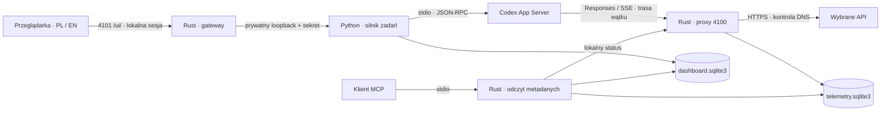

# Architektura 3api

[README](../README.md) · [Start](STARTUP.md) · [MCP](MCP.md) · [Bezpieczeństwo](SECURITY.md)

Rust obsługuje publiczne HTTP, proxy Responses i MCP. Python pozostaje prywatnym silnikiem zadań: prowadzi Codex App Server, utrwala rozmowy, skanuje zmiany i zarządza eksperymentalnymi kopiami roboczymi. Panel korzysta z lokalnych zasobów HTML/CSS/JS.

## Przepływ danych

## Granice komponentów

| Komponent | Odpowiedzialność | Lokalizacja w źródłach |
| --- | --- | --- |
| Program Rust | CLI, porty, uruchomienie i zatrzymanie własnego workera | `src/main.rs` |
| Gateway | Automatyczna sesja, Host/Origin, limity i połączenie z workerem | `src/gateway.rs` |
| Proxy | Konfiguracja, sekrety providerów, routing, cooldown, Responses/SSE i telemetria | `src/proxy/` |
| MCP | Ograniczone narzędzia i zasoby przez stdio | `src/mcp.rs` |
| Worker | API panelu oraz cykl życia Codex App Servera | `dashboard/sidecar.py`, `server.py`, `runner.py` |
| Trwały stan | Czaty, uruchomienia, preferencje i zmiany plików | `dashboard/store.py`, `changes.py`, `preferences.py` |
| Eksperyment | Przydział wykonawców, kopie, kontrola zakresu i scalanie | `dashboard/experiment.py` |
| Interfejs | Wybrany kontekst, szkice, polling, formularze i historia | `dashboard/assets/` |

`GET /ui/` ustanawia lokalną sesję bez formularza tokenu. Pozostają kontrola Host/Origin, cookies HttpOnly/SameSite i CSRF dla operacji zapisujących dane. Gateway przekazuje osobny sekret workera; przeglądarka i procesy Codexa go nie otrzymują. Wewnętrzny token proxy jest przygotowywany automatycznie.

## Projekt, czat i uruchomienie

`project_id` identyfikuje projekt. Dotychczasowe `task.id` identyfikuje **trwały czat**, a `run_id` — pojedyncze przyjęte polecenie. Nowy pusty czat zapisuje się przed wysłaniem pierwszej wiadomości. Kontynuacja zachowuje rozmowę i dodaje uruchomienie; nie zastępuje wcześniejszej historii.

Workspace ma rodzaj `project` albo `chat`. Rozmowa bez istniejącego projektu dostaje katalog `tempfile.gettempdir()/3api-chats/<hash-data-dir>/chat-<losowy-id>`, zapisany w bazie. Tryb `isolated` wymusza zatwierdzanie i `workspace-write`; jawnie potwierdzony `full` używa YOLO / `danger-full-access`. Oba mają ten sam katalog roboczy w temp, a skan zmian obejmuje tylko ten katalog. Nie jest to rejestr wszystkich zmian komputera wykonanych w trybie pełnego dostępu.

Usunięcie workspace'u archiwizuje wpis i ukrywa związane czaty bez kasowania plików lub historii. Ponowne dodanie tej samej ścieżki przywraca identyfikator i historię. Aktywne i odzyskiwane uruchomienia blokują archiwizację. Katalog rozmowy przeżywa restart aplikacji; utrata folderu wskutek zewnętrznego czyszczenia temp powoduje czytelny błąd startu, bez automatycznego tworzenia pustej kopii w miejsce dawnej pracy.

Każde uruchomienie ma własny punkt odniesienia zmian i zapisany wynik. Ponowienie tego samego `client_request_id` zwraca istniejące uruchomienie, dzięki czemu niepewny wynik żądania sieciowego nie powinien powodować podwójnego startu pracy.

Tworzenie projektów i pustych czatów także przyjmuje `client_request_id`. Para operacja/ID i fingerprint treści są zapisywane atomowo wraz z zasobem. Powtórzenie tego samego body zwraca istniejący zasób, także po restarcie. Inne wartości body pod tym samym ID lub próba odtworzenia usuniętej pozycji starym retry zwracają `409`. Świadome ponowne dodanie zarchiwizowanej ścieżki używa nowego ID. Replay projektu jest sprawdzany przed tworzeniem kolejnego katalogu temp.

| Stan | Interpretacja |
| --- | --- |
| Praca | Uruchomienie działa lub przygotowuje pracę. |
| Oczekiwanie na użytkownika | Potrzebna jest odpowiedź lub zatwierdzenie; to nie ukończenie. |
| `finalizing` | Trwa zapis końcowych wyników, diffu i pomiarów. |
| `completed` | Zapis końcowych wyników został ukończony. |
| Błąd | Uruchomienie zakończyło się błędem. |
| Anulowanie / przerwanie | Praca została zatrzymana; historia pozostaje dostępna. |

Zielone potwierdzenie w UI jest zarezerwowane dla `completed`. Restart nie zamienia niedokończonej pracy w sukces. Zakończenie, błąd, anulowanie i restart zwalniają rezerwacje API.

## Kontrakt API panelu

| Operacja | Kontrakt |
| --- | --- |
| `POST /ui/api/chats` | Utrwala również pusty nowy czat; obsługuje idempotentne tworzenie z `client_request_id`. |
| `POST /ui/api/projects` | Tworzy projekt z katalogiem albo rozmowę z własnym katalogiem temp i zapisanym zakresem dostępu; obsługuje `client_request_id`. |
| `DELETE /ui/api/projects/{project_id}` | Archiwizuje wpis bez kasowania folderu; aktywna praca zwraca konflikt `409`. |
| `POST /ui/api/tasks` | Zachowuje dotychczasowe argumenty, przyjmuje `client_request_id`, zwraca `{id, run_id, state}`. |
| `GET /ui/api/state` | Zachowuje wcześniejsze pola, dodaje `schema_version: 2` i identyfikatory żądanego projektu, czatu oraz uruchomienia. |
| `GET /ui/api/projects/{project_id}/chats` | Lista czatów projektu. |
| `GET /ui/api/projects/{project_id}/history` | Lista uruchomień projektu; opcjonalny filtr `task_id`. |
| `GET /ui/api/tasks/{task_id}/runs/{run_id}` | Szczegóły wybranego uruchomienia, w tym stronicowane wiadomości, zmiany i zdarzenia API. |

Listy przyjmują `cursor` i `limit`; odpowiedź ma postać `{items, next_cursor}`. Brak `messages` lub `changes` w odpowiedzi skróconej nie oznacza pustej listy. Klient zachowuje wcześniej pobrane szczegóły, dopóki nie otrzyma jawnej aktualizacji dla tego samego kontekstu.

Rekord `Run` zawiera: `id`, `task_id`, `project_id`, `state`, `started_at`, `finished_at`, `elapsed_seconds`, `agents_count`, `api_ids`, `files`, `added`, `removed`, `touched_files`, `changes_revision`, `scan_status` i `usage`. Czasy są sekundami Unix. Brak dawnych pomiarów to `null`, nie odtworzony szacunek ani sztuczne zero.

Publiczne punkty rozszerzeń zachowują nazwy `DashboardStore`, `CodexRunner`, `create_app` i `createControls`. Store udostępnia `create_chat`, `list_runs`, `load_run` i `save_run`. Moduł `dashboard/assets/history.js` eksportuje `createHistory({api, getProject, getTask, onSelectRun})`.

## Polling i spójność interfejsu

Widok rozróżnia aktywny projekt, czat i uruchomienie. Żądanie odświeżenia należy do kontekstu, z którego zostało wysłane. Spóźniona odpowiedź po przełączeniu projektu lub czatu nie może zastąpić aktualnego widoku. Błąd sieci nie usuwa pobranej rozmowy, diffów ani historii.

Wybór czatu, API i szkic są przechowywane osobno dla projektów. Historia szczegółów jest scalana według identyfikatora uruchomienia; przy odświeżaniu zachowane są otwarte diffy i pozycja przewinięcia. Dane globalnego obciążenia providerów nie są ograniczone do oglądanego czatu.

Wspólne selektory: `#project-list [data-project]`, `#task-list [data-task]`, `#changes`, `[data-provider]`, `[data-task-status]`, `[data-provider-role]`, `#run-history [data-run-id]` oraz `#project-change-summary`. Teksty PL/EN opisują te same stany; treści użytkownika pozostają w oryginalnym języku.

## Zmiany i pomiary

`files`, `added` i `removed` opisują diff względem początku **jednego uruchomienia**. To stan różnicy, nie suma każdej próbki pollingu. Ten sam odczyt nie zwiększa liczników ponownie.

`touched_files` i historia zmian zachowują zaobserwowane edycje później cofnięte. Dlatego plik może pozostać w historii pracy, choć końcowy diff jest pusty. Skanowanie okresowe nie gwarantuje uchwycenia każdej krótkotrwałej edycji pomiędzy skanami. `changes_revision` pozwala rozpoznać nową wersję zmian, a `scan_status` odróżnić wynik od trwającego lub nieudanego skanu.

`agents_count` dotyczy rzeczywistych wątków agentów, nie liczby zaznaczonych providerów. `api_ids` informuje o użytych API. Czas uruchomienia i usage mają własne źródła pomiarów; brak usage nie jest zerowym zużyciem. Cache jest częścią wejścia, a reasoning częścią wyjścia — tych kategorii nie dodaje się drugi raz do sumy.

## Globalne przydziały API

Zwykły tryb `mode=standard`, `effort=ultra` rozróżnia role `main` i `auxiliary`. `POST /admin/routes` przyjmuje kontekst `project_id`, `task_id`, `run_id`, `thread_id` oraz `role`. Rola wynika ze zweryfikowanego rzeczywistego wątku lub osobnej trasy, nie z kolejności żądań HTTP.

Rezerwacje są globalne dla projektów i pozostają aktywne między żądaniami danego wątku. Przydział jest atomowy i obejmuje tylko wybrane API zgodne z modelem. Uwzględnia cooldown i budżet oczekiwania.

| Rola | Kolejność preferencji |
| --- | --- |
| `main` | Wolne API → API zajęte wyłącznie pomocniczo → najmniej obciążone dostępne API. |
| `auxiliary` | API współdzielone z pracą pomocniczą → wolne API → najmniej obciążone dostępne API. |

Stan providera udostępnia `main_count`, `auxiliary_count`, `in_flight` i `assignments` z identyfikatorami oraz rolą. Liczniki rezerwacji opisują przypisane wątki; `in_flight` opisuje aktualne żądania. Brak żądania w tej chwili nie oznacza zwolnienia rezerwacji wątku. `POST /admin/routes/release` zwalnia zakończony `run_id`.

Eksperymentalny zespół pozostaje osobnym trybem z kopiami roboczymi i kontrolą scalania. Kontrola zakresu plików nie stanowi izolacji systemu operacyjnego.

## Prompty i eksperymentalny zespół

`main_prompt` i `coordinator_prompt` są ustawieniami panelu zapisanymi w bazie; nie zmieniają globalnego `config.toml` Codexa. Brakujące lub `null` wartości dostają gotowe instrukcje. Zapisane stringi, także puste, pozostają bez zmian. UI nie powinien nadpisywać edytowanego formularza kolejną odpowiedzią pollingu.

Koordynator na Ultra pracuje tylko do odczytu, definiuje wspólne interfejsy i dokładnie dwa pakiety z rozłączną własnością plików. Dwa pozostałe API obsługują wykonawców na Ultra we własnych kopiach; po planowaniu API koordynatora zostaje rezerwą. Puste `owned_paths` oznacza przegląd początkowego stanu, z trybem odczytu wymuszonym w protokole. Nie oznacza dostępu do wyników drugiego wykonawcy przed scaleniem.

Kontrola scalenia chroni własność ścieżek i zmiany użytkownika. Testy wymagające obu pakietów pozostają jawnie niesprawdzone, dopóki nie zostaną wykonane na połączonym wyniku. Zniknięcie zapisanej kopii roboczej nie uprawnia workera do cichego ponowienia zakończonej pracy.

## Minutowy budżet tokenów

Każdy provider ma `tokens_per_minute=1000000`, `soft_tokens_per_minute=900000` i `hard_tokens_per_minute=950000`, jeśli konfiguracja nie określa innych wartości. Walidacja wymaga `0 < soft < hard <= limit`. To wspólny budżet głównych i pomocniczych żądań przez ten proxy, niezależnie od projektu.

Okno obejmuje 60 sekund od raportowania usage. Obciążenie sumuje raportowane tokeny i rezerwacje żądań w toku. Bez raportu usage estymata jest zachowana przez 60 sekund i oznaczona jako szacunkowa; nie jest przepisywana jako rzeczywisty wynik. Trwały zapis SQLite odtwarza okno i niezakończone rezerwacje po restarcie.

Próg soft preferuje zgodne API poniżej progu; przy braku takiej alternatywy można korzystać z API poniżej hard. Próg hard lub przewidywane przekroczenie przez nowe żądanie blokuje jego start, z ograniczonym czasem oczekiwania i odpowiedzią `429` / `Retry-After`. Trwający strumień jest kontynuowany. Ten mechanizm nie widzi żądań wykonanych poza proxy ani nie potwierdza limitu konta u dostawcy.

## Responses, SSE i telemetria

Proxy obsługuje `/v1/responses`, `/v1/responses/compact` i trasy `/r/{route_id}/v1/...`. Sekrety providerów pozostają po stronie serwera. SSE jest analizowane przy ograniczonym rozmiarze bufora, czasu i strumienia.

Retry zależy od strukturalnych statusów i zdarzeń protokołu. Tekst modelu wspominający o limitach nie jest błędem API. Nie wolno łączyć fragmentów różnych providerów w jedną odpowiedź; kontynuację po przerwanym strumieniu prowadzi Codex.

Telemetria i historia rozmów są odrębne. SQLite przechowuje próby i zdarzenia API; finalizacja próby musi być idempotentna. Odebranie terminalnego zdarzenia upstream oraz przygotowanie HTTP Body nie dowodzi dostarczenia ostatnich bajtów klientowi przez TCP ani ukończenia całego uruchomienia.

## Dane i MCP

Domyślny katalog to `data/rust/`: bazy panelu i telemetrii, snapshoty oraz dane robocze. Stare rekordy mogą zawierać bezwzględne ścieżki do wcześniejszych projektów; [migracja](MIGRATION.md) wymaga sprawdzenia tych odwołań.

MCP odczytuje ograniczone metadane przez stdio, z baz otwartych tylko do odczytu. Nie przyjmuje dowolnych ścieżek, nie wykonuje poleceń i nie uruchamia zadań. Pięć narzędzi i konfigurację opisuje [MCP.md](MCP.md). Dane MCP nie są instrukcjami dla klienta.

## English overview

Rust owns public HTTP, the browser gateway, Responses routing, telemetry and MCP. Python remains the private task engine. Opening `/ui/` automatically establishes a local session while retaining Host/Origin checks, CSRF and HttpOnly/SameSite cookies.

`task.id` is a persistent chat; each accepted instruction creates a separate `run_id` with its own change baseline. History survives continuation and restart. The API distinguishes omitted details from empty lists, paginates run history and preserves missing historical measurements as `null`. UI polling rejects stale responses and keeps known details after network failures.

Provider reservations are global across projects and persist between requests. Verified thread roles determine main/auxiliary allocation; `in_flight` is separate from reservation counts. Completed, failed, cancelled and interrupted runs release assignments. Only `completed`, after final results have been saved, receives a green check in the UI.

The Windows dashboard release includes a Python worker and bootstrap; it is not a standalone EXE-only dashboard. See [SECURITY.md](SECURITY.md) for trust boundaries and [VERIFICATION.md](VERIFICATION.md) for actual validation results.

Standalone chats have persistent system-temp directories and an explicit isolated/full access choice. Removing a workspace archives its database entry without deleting files or history; re-adding the same path restores it. Main/coordinator prompts are filled for missing settings while preserving custom strings. The experimental coordinator plans read-only, then exactly two Ultra workers use separate copies and disjoint file ownership.

Per-provider defaults are 1,000,000 TPM with 900,000 soft and 950,000 hard thresholds. A persisted rolling window combines reported usage and clearly labeled reservations/estimates. Soft limits prefer another compatible API; hard limits defer new requests without terminating a running stream. Calls outside this proxy are not counted.
