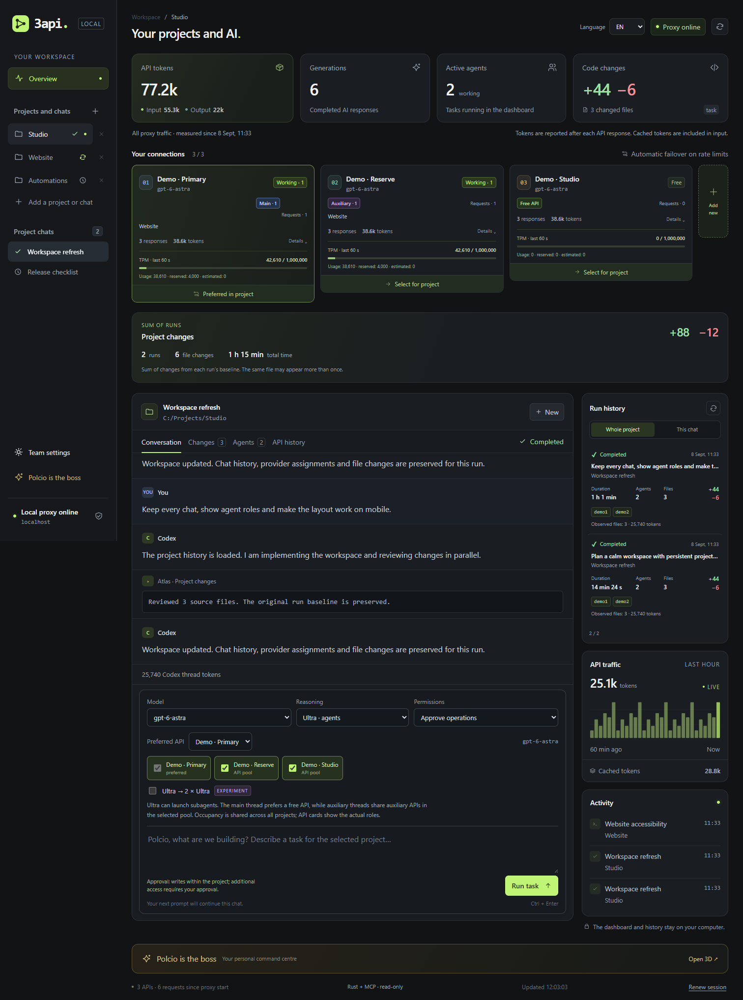
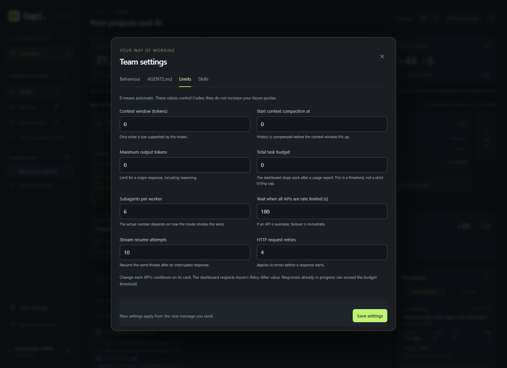

# Galeria / Gallery

[README PL](../README.md) · [README EN](../README.en.md) · [Start](STARTUP.md) · [Weryfikacja / Verification](VERIFICATION.md)

Zrzuty przedstawiają bieżący interfejs uruchomiony lokalnie w Microsoft Edge. Projekty, rozmowy, endpointy i liczby są fikcyjnymi danymi demonstracyjnymi z `scripts/serve_demo.py`. Obrazy nie przedstawiają prywatnej historii ani pomiarów płatnych API. Dwóm własnym zdjęciom użytkownika odpowiadają pola `DISCORD_IMAGE_1_URL` i `DISCORD_IMAGE_2_URL` na samej górze README.

These screenshots show the current interface running locally in Microsoft Edge. Projects, conversations, endpoints and metrics are synthetic data from the offline demo. They do not represent private history or paid API measurements. The two Discord placeholders at the top of each README are reserved for the user's own images.

## Panel PL

Wiele czatów, globalne role API, minutowe budżety, zapisane zmiany i historia uruchomień. / Multiple chats, global API roles, minute budgets, saved changes and run history.


## Dashboard EN

Ten sam interfejs po angielsku; treść rozmowy i nazwy projektów nie zmieniają się przy wyborze języka. / The same interface in English; conversation content and project names remain unchanged when switching languages.



## Historia i diff / History and diff

Wybrane wcześniejsze uruchomienie i zapisany diff z jego punktu odniesienia. / An earlier run and its saved diff from that run's baseline.


## Gotowe prompty / Default prompts

Widoczne instrukcje głównego agenta oraz planisty dwóch wykonawców. Domyślne prompty są po polsku i można je edytować niezależnie od języka UI. / Visible main-agent and two-worker planner instructions. Default prompts are in Polish and can be edited independently of the interface language.


## Limity jednego API / Per-API limits

Osobny budżet 1 000 000 tokenów na minutę oraz progi 900 000 i 950 000. Pole klucza pozostaje puste. / A separate 1,000,000-token minute budget with 900,000 and 950,000 thresholds. The API key field is empty.


## Projekt albo rozmowa / Project or chat

Rozmowa z własnym folderem temp albo jawnym pełnym dostępem. / A chat with its own temporary folder or an explicit full-access choice.


## Żądania i wznawianie / Requests and reconnects

Limity kontekstu, liczba subagentów oraz skończone budżety ponowień i oczekiwania. / Context settings, subagent count and bounded retry/wait budgets.



## Telefon / Mobile

Rzeczywisty viewport 390 × 1100; przewijany widok kart API. / A real 390 × 1100 viewport showing the scrollable API cards.

<p align="center"></p>

## Odtworzenie / Reproduce

Po przygotowaniu zależności Playwright opisanych w README: / After preparing the Playwright dependencies described in the README:

```powershell
$env:PLAYWRIGHT_CHANNEL = 'msedge'
node tests/browser/capture-demo.mjs --output docs/images
```

Skrypt uruchamia własne demo na loopback, używa nowego profilu przeglądarki, zapisuje osiem PNG i zamyka swoje procesy. Nie łączy się z providerami. / The script starts its own loopback demo, uses a fresh browser profile, saves eight PNGs and closes its processes. It does not contact providers.
